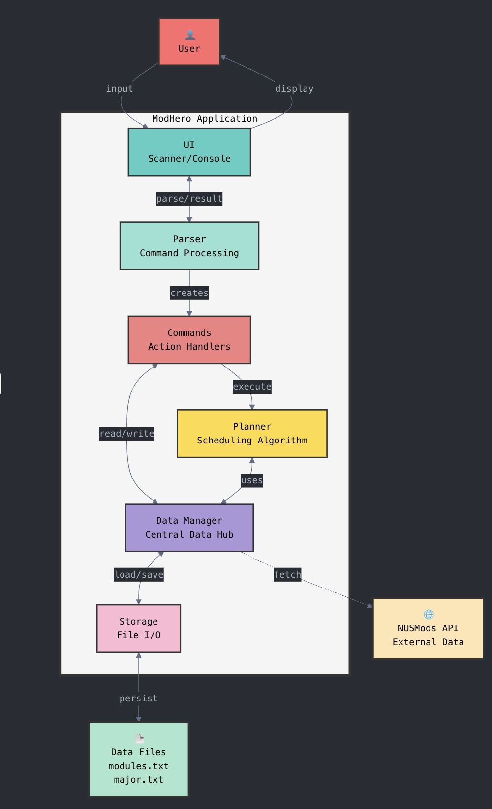
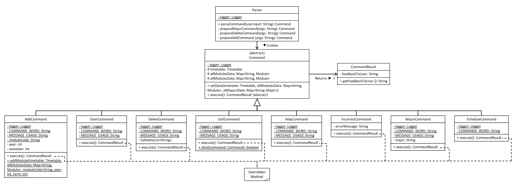
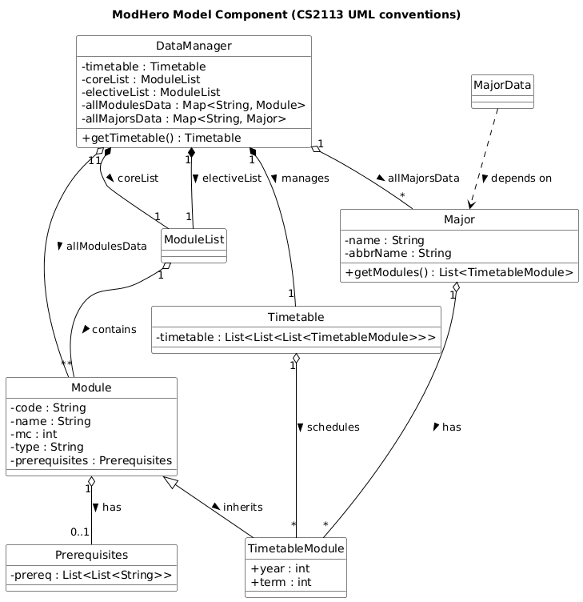
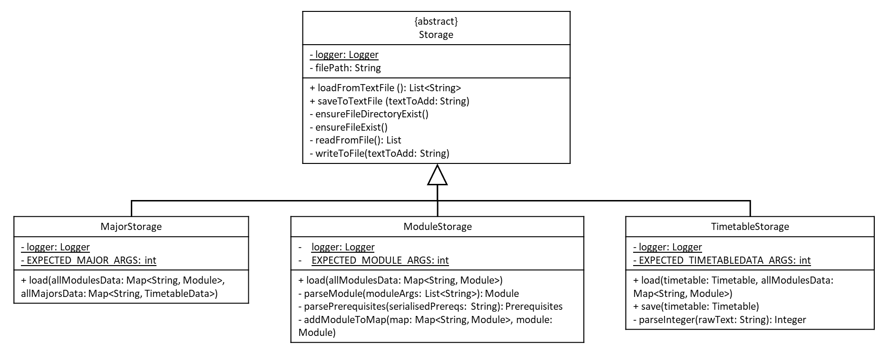
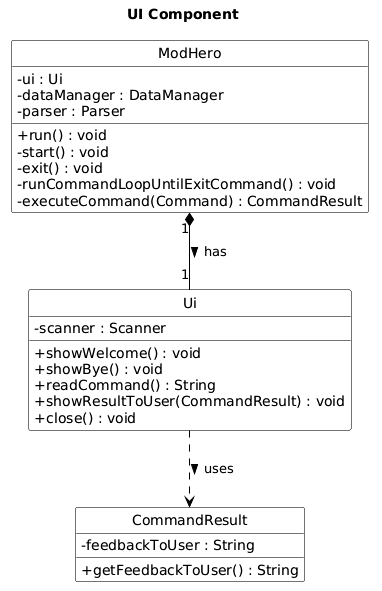
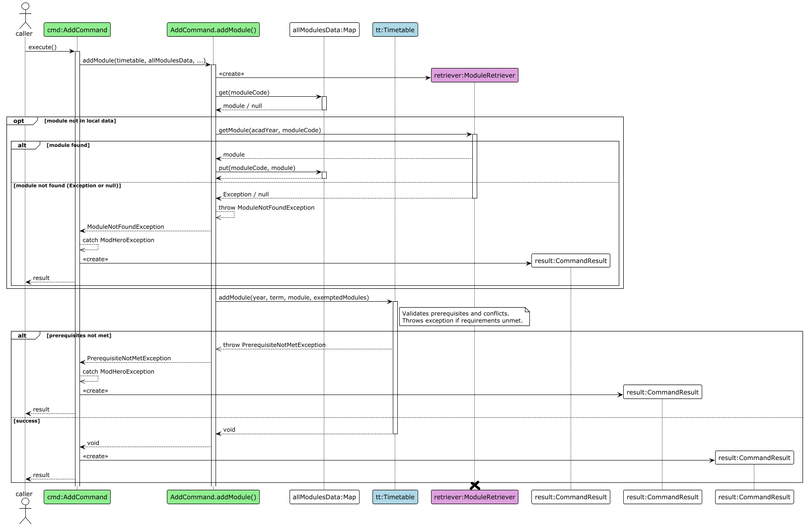
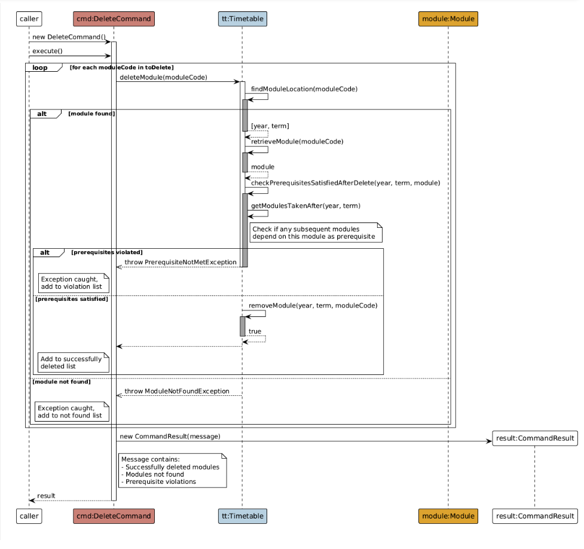

# Developer Guide
- [Getting Started](#getting-started)
- [Design & Implementation](#design--implementation)
    - [High-Level Architecture](#high-level-architecture)
    - [Model Component](#model-component)
    - [Storage Component](#storage-component)
- [Implementation](#implementation)
  - [Add Feature](#add-feature)
- [Documentation, Logging and Testing](#documentation-logging-and-testing)
- [Appendix: Requirements](#appendix-requirements)
    - [Product Scope](#product-scope)
    - [User Stories](#user-stories)
    - [Non-Functional Requirements](#non-functional-requirements)
    - [Glossary](#glossary)
- [Appendix: Instructions for Manual Testing](#appendix-instructions-for-manual-testing)

---

## Acknowledgements
This project was built based on the architecture and documentation style of [AddressBook-Level3 (AB3)](https://se-education.org/addressbook-level3/).  
Concepts, diagram formats, and document structure have been adapted from it for educational purposes.

## Getting Started

## Design & Implementation
This section describes the overall design of **ModHero**, followed by explanations of each major component.  
It serves as a roadmap for future developers to understand how the system is structured, how the components interact, and how each part fulfills its role.

### High-Level Architecture
<figure align="center">
  
  <figcaption><em>High-Level Architecture Diagram of ModHero</em></figcaption>
</figure>

The **ModHero** architecture follows a modular structure inspired by AddressBook-Level3. It comprises four main components:
- **UI** -- Handles user interaction and display.
- **Logic** — Parses and executes user commands.
- **Model** — Maintains in-memory data (modules, majors, timetable).
- **Storage** — Manages persistent data on disk.

At launch, `Main` initializes these components and connects them.  
At shutdown, it ensures all data is saved correctly to persistent storage.

### Logic Component
<figure align="center">
    
    <figcaption><em>UML class diagram showing relationships within the Parser component.</em></figcaption>
</figure>

### Model Component
**API:** `Model.java`

The **Model component** is responsible for managing all in-memory data of ModHero.  
It encapsulates the application’s state — including modules, majors, prerequisites, and the user’s 4-year timetable — and provides APIs for other components to access or modify this data safely.

It resides in the package `modhero.data` and its sub-packages:
- `modhero.data.major`
- `modhero.data.modules`
- `modhero.data.timetable`

#### UML Structure
<figure align="center">
  
  <figcaption><em>UML class diagram showing relationships within the Model component.</em></figcaption>
</figure>

#### Key Responsibilities
- **DataManager** – Central data coordinator that loads, stores, and provides access to model entities.
- **Timetable** – Maintains the 4-year plan, organizing modules by year and semester.
- **Module** – Represents an individual module with code, name, MCs, and prerequisite structure.
- **ModuleList** – Groups modules logically (e.g., core or elective).
- **Prerequisites** – Captures module prerequisites as nested lists.
- **MajorData** – Defines core module sets for each supported major.
- **TimetableModule** – Extends `Module` by adding `year` and `term` fields to specify when a module is taken.

#### Design Rationale
- **Inheritance:** `TimetableModule` *is-a* `Module`, enriched with temporal (year, term) information.
- **Composition:** `DataManager` *has-a* `Timetable`, `ModuleList`, and `Prerequisites` — they exist only while `DataManager` exists.
- **Aggregation:** Modules and majors can exist independently and are aggregated under `DataManager`.

This separation allows the Model to remain cohesive yet modular, enabling clean integration with other components such as Storage and Logic.

### Storage Component
<figure align="center">
    
    <figcaption><em>UML class diagram showing relationships within the Storage component.</em></figcaption>
</figure>

The Storage component is responsible for loading and saving essential application data.
It reads text files from predefined directories and converts their contents into a structured, accessible format for other components to process.

Three primary classes, ModuleStorage, MajorStorage and TimetableStorage, rely on Storage to retrieve module and major data to construct the timetable.
These loaders then deserialize the loaded text into objects such as Module, Major, and Prerequisites, which are stored in in-memory hash maps for efficient access.
The process is supported by two utility classes, SerialisationUtil and DeserialisationUtil, which enhance data conversion and validation.

Each text file is stored in a unique, well-defined format, ensuring accurate data retrieval without missing words or parsing errors.
Deserialization also serves as a validation step, confirming that the entire file has been successfully read and processed.

To maintain data integrity and readability, all data should be serialized before saving, ensuring a consistent and reliable file structure for future loading operations.


### UI Component
<figure align="center">
    
    <figcaption><em>UML class diagram showing relation between UI object and Modhero.</em></figcaption>
</figure>

The UI component is responsible for all interactions between the user and the program. This includes being the point at which all user inputs are collected 
and all outputs to the user are displayed through. All inputs are read by the ```readCommand``` method which trims the user output.
The output methods included in this class are the methods to show the welcome message, bye message, and the 
feedback for executing any given command. 
#### Serialiser

All data are stored in a serialised format following this convention `[content length][start delimiter][content][end delimiter]`.
This format ensures that any characters and symbols in the content will not be able to interfere with splitting the content into the correct component.
Furthermore, it is able to ensure that all the text required for the component has been read successfully without any data corruption.

It can be used to serialise a string or a one dimension list of strings. Deserialising it will return it back to it original list form.
Nested List can also be serialised by performing serialised on each dimension of the list and combining them together as a string.
It is also able to serialise objects with different data types. For example, the module data consist of module code and prerequisite which is in String and Nested List.
It can be serialised by performing serialised on each data type and combing them together.

## Implementation
This section describes some noteworthy details on how certain features are implemented.

### Add Feature

#### Overview
The `add` feature allows users to add a module to their timetable in a specific year and semester. (For the usage, please go to our [User Guide](UserGuide.md) for more information) The feature is encapsulated by the `AddCommand` class, which serves as the controller for this operation. It coordinates fetching module data (from a local cache `allModulesData` or the NUSMODS API) and then delegates the core logic of adding the module and checking business rules to the Timetable model.

#### Key Components
- **`AddCommand.java`**: The command class that parses the user's intent. Its `execute()` method orchestrates the entire "add" operation.
- **`Timetable.java`**: The data model representing the user's timetable. It is responsible for all business logic, such as checking for duplicates, validating prerequisites (`checkModuleAddable`), and storing the module (`addModuleInternal`).
- **`ModuleRetriever.java`**: A utility class used by `AddCommand` to fetch module details from the external NUSMODS API if the module isn't found in the local `allModulesData` cache.
- **`allModulesData` (Map)**: A map that acts as a local cache for module data to minimize API calls.

#### Sequence Diagram
This diagram illustrates the typical flow for adding a module that is *not* yet in the local cache (`allModulesData`) but *is* found in the NUSMODS API, and for which the user *meets* the prerequisites.

<figure align="center">
    
    <figcaption><em>Add Command Sequence Diagram</em></figcaption>
</figure>

#### Detailed Execution Flow
1.  **Initiation**: The `execute()` method of `AddCommand` is called.
2.  **Cache Check**: It first attempts to get the `Module` object from the local `allModulesData` cache.
3.  **API Fallback (Optional)**:
    * If the module is `null` (not in the cache), the command enters an **`opt`** (optional) fragment.
    * It calls `getModule()` on the `ModuleRetriever`.
    * **`alt` [Module Not Found]**: If the retriever returns `null`, a `ModuleNotFoundException` is thrown, caught by `AddCommand`, and returned as an error `CommandResult`.
    * **`else` [Module Found]**: If the retriever returns a valid `Module` object, it is saved to the `allModulesData` cache for future use.
4.  **Timetable Delegation**: The `AddCommand` calls `timetable.addModule()` with the `Module` object and target location.
5.  **Business Logic Validation**:
    * Inside `timetable.addModule()`, the first step is to call its own `checkModuleAddable()` method.
    * This check performs two key validations:
        1.  **Duplicate Check**: It calls `getAllModules()` to see if the module code already exists in the timetable.
        2.  **Prerequisite Check**: It calls `getModulesTakenUpTo()` to get a list of all modules taken before or during the target semester. It then gets the `Prerequisites` from the `module` and checks if the list of completed modules satisfies any of the prerequisite options.
6.  **Handling Validation Result**:
    * **`alt` [Checks Fail]**: If the module already exists or prerequisites are not met, `checkModuleAddable()` throws a `ModHeroException` (e.g., `ModuleAlreadyExistsException`, `PrerequisiteNotMetException`).
    * This exception propagates up to `AddCommand`, which catches it and returns a `CommandResult` with the error message.
    * **`else` [Checks Pass]**: If all checks pass, `timetable.addModule()` proceeds.
7.  **Final Add**: The method calls `addModuleInternal()`, which performs the simple action of adding the `Module` object to the correct `ArrayList` in the `timetable` data structure.
8.  **Success Result**: `AddCommand` creates a new `CommandResult` with a success message and returns it to the caller.

### Delete Feature
#### Overview
The ```Delete``` feature allows the user to delete a given module from the timetable while making sure
that it doesn't affect the prerequisites for one of the other modules in the timetable. The expected arguments taken in
by the delete command is the list of all modules the user wants to delete and the feedback to the user is a list of 
modules that have successfully been deleted, and a list of modules that could not be deleted and the reason behind them.
The details about how to use the feature are in the user guide. 

#### Sequence Diagram
<figure align="center">
    
    <figcaption><em>Delete Command Sequence Diagram</em></figcaption>
</figure>

#### Execution Flow of the Delete Command
1. The Delete feature is encapsulated in the `DeleteCommand` Class, which is instantiated by the parser when the user 
inputs the delete command
2. The Constructor for the Delete command parses the list and stores the list of modules slated to be deleted by the user. 
If any of the module codes contain lower case letters it capitalises them so that the timetable can recognise them.
3. When the `execute()` method of the `DeleteCommand` is called, command calls the internal `deleteModule` method from the `Timetable`
object for each of the modules
4. The timetable silently deletes all the specified modules and only throws an exception if the module specified does not
exist in the timetable or is a prerequisite to another module in the timetable.
5. Modules that could not be deleted due to prerequisites or not being in the Timetable is stored in a separate list, and
the modules that could and couldn't be deleted with their reason are turned into a string and used to instantiate a command
which is then returned to be displayed to the user by the UI.

#### Internal Details of the `deleteModule` method of the Timetable object
1. The `deleteModule` method takes only the module to be deleted as the input
2. The method then calls the `findModuleLocation` method to get the year and semester in which the module is located. If
the module does not exist in the timetable, a `ModuleNotFound` exception is thrown
3. Then the `checkPrerequisitesSatisfiedAfterDelete` method is called to check whether the user is deleting a prerequisite
to another module in the timetable. This method is silently executed and returns nothing. Only if it detects a module for
which the prerequisite is being violated, it throws a PrerequisiteNotMet exception and cancels the delete operation.
4. Given that the module exists in the timetable and deleting it does not affect another module's prerequisites, it now 
deletes the module.

#### Error Handling
Error handling is centralized within the `execute()` method of `AddCommand`. A `try-catch` block wraps the entire logic.

- Any `ModHeroException` (e.g., `InvalidYearOrSemException`, `ModuleNotFoundException`, `ModuleAlreadyExistsException`,`PrerequisiteNotMetException`) thrown by `Timetable` or `ModuleRetriever` is caught.
- The exception's message (`e.getMessage()`) is used to create a new `CommandResult`, ensuring that the user receives a clean, specific error message without crashing the application.
- A general `Exception` catch block also exists to handle any unexpected errors, logging them and returning a generic error message.

## Documentation, Logging and Testing

## Appendix: Requirements

### Product Scope

#### Target User Profile
{Describe the target user profile.}

#### Value Proposition
{Describe the value proposition: what problem does it solve?}

### User Stories

| Version | As a ... | I want to ... | So that I can ... |
|----------|-----------|---------------|-------------------|
| v1.0 | NUS student | view a list of available commands | understand how to use ModHero efficiently |
| v1.0 | NUS student | specify my major | load the correct core and elective modules for my degree |
| v1.0 | NUS student | generate a recommended 4-year study plan | visualize my academic progression and ensure graduation requirements are met |
| v1.0 | NUS student | add a specific module to a semester | customize my study plan according to my interests or scheduling needs |
| v1.0 | NUS student | delete a module from my timetable | adjust my plan when I drop or change modules |
| v1.0 | NUS student | list all core and elective modules for my major | plan my semesters with awareness of compulsory and optional modules |
| v2.0 | NUS student | check prerequisites of a module | avoid planning invalid module combinations |
| v2.0 | NUS student | automatically verify that all prerequisites are met | ensure my plan is valid before registration |
| v2.0 | NUS student | save my timetable to a file | persist my customized schedule for later use |
| v2.0 | NUS student | load my saved timetable | restore my plan without re-entering all modules |

### Use Cases

### Non-Functional Requirements

{Give non-functional requirements.}

### Glossary

- *glossary item* — Definition.

## Appendix: Instructions for Manual Testing

{Give instructions on how to do manual testing, e.g., how to load sample data or verify stored files.}

### Launch and shutdown
1. Initial launch 
2. Download the jar file and copy into an empty folder 
3. Double-click the jar file Expected: Shows the Command prompt terminal. 
4. Close the window or give the `exit` command. 
5. Re-launch the app by double-clicking the jar file.

### Selecting a major
1. Test case: `major cs`  
   Expected: Will show successful message

2. Test case: `major computer science`  
   Expected: Will show successful message

3. Test case: `major cs minor in business`  
   Expected: Will not be successful added as only the main major is needed

4. Test case: `major ce`  
   Expected: Will not be added only cs and ceg are supported

### Adding a module
**Prerequisites:** Start a new session without any exemption

1. Test case: `add CS2113 to Y1S1`  
   Expected: Will not be added successfully as there are required prerequisites before taking CS2113

2. Test case: `add CS2113 to Y10S1`  
   Expected: Will not be added successfully as it is a planner for 4 years in NUS

3. Test case: `add ES1000 to Y1S1`  
   Expected: Will be added successfully as there is no prerequisites for this module

4. Test case: `add ES1000 to Y1S2`  
   Expected: Will not be added as this module is already in the timetable

### Deleting a module
**Prerequisites:** Generate schedule using `schedule` to know what module code is in there. Ensure CS2113 is in there

1. Test case: `delete CS2113`  
   Expected: Will be deleted

2. Test case: `delete ABCDEF`  
   Expected: Will not be deleted as no such module code exist

### Loading and saving of customised timetable
- After customising timetable, type `schedule` to generate the timetable, it will also save it
- Close the application.
- Re-launch the application will load the timetable data automatically.