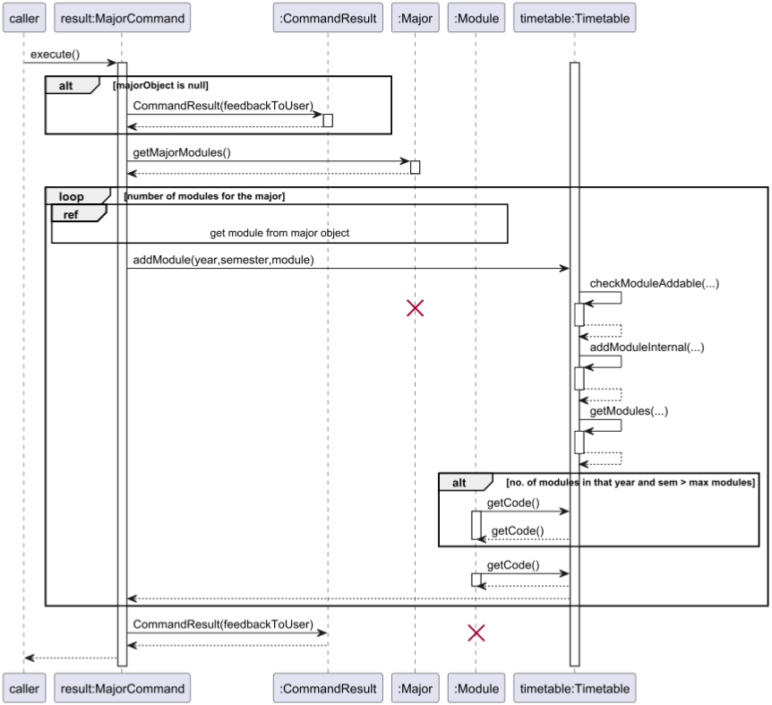
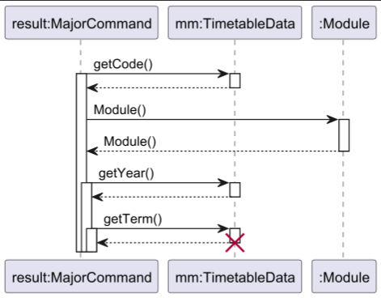

# Developer Guide
- [Getting Started](#getting-started)
- [Design & Implementation](#design--implementation)
    - [High-Level Architecture](#high-level-architecture)
    - [Model Component](#model-component)
    - [Storage Component](#storage-component)
- [Implementation](#implementation)
    - [Add Feature](#add-feature)
    - [Major Feature](#major-feature)
- [Documentation, Logging and Testing](#documentation-logging-and-testing)
- [Appendix: Requirements](#appendix-requirements)
    - [Product Scope](#product-scope)
    - [User Stories](#user-stories)
    - [Non-Functional Requirements](#non-functional-requirements)
    - [Glossary](#glossary)
- [Appendix: Instructions for Manual Testing](#appendix-instructions-for-manual-testing)

---

## Acknowledgements
This project was built based on the architecture and documentation style of [AddressBook-Level3 (AB3)](https://se-education.org/addressbook-level3/).  
Concepts, diagram formats, and document structure have been adapted from it for educational purposes.

## Getting Started

## Design & Implementation
This section describes the overall design of **ModHero**, followed by explanations of each major component.  
It serves as a roadmap for future developers to understand how the system is structured, how the components interact, and how each part fulfills its role.

### High-Level Architecture
<figure align="center">
  
  <figcaption><em>High-Level Architecture Diagram of ModHero</em></figcaption>
</figure>

The **ModHero** architecture follows a modular structure inspired by AddressBook-Level3. It comprises four main components:
- **UI** -- Handles user interaction and display.
- **Logic** — Parses and executes user commands.
- **Model** — Maintains in-memory data (modules, majors, timetable).
- **Storage** — Manages persistent data on disk.

At launch, `Main` initializes these components and connects them.  
At shutdown, it ensures all data is saved correctly to persistent storage.

### Logic Component
<figure align="center">
    
    <figcaption><em>UML class diagram showing relationships within the Parser component.</em></figcaption>
</figure>

### Model Component
**API:** `Model.java`

The **Model component** is responsible for managing all in-memory data of ModHero.  
It encapsulates the application’s state — including modules, majors, prerequisites, and the user’s 4-year timetable — and provides APIs for other components to access or modify this data safely.

It resides in the package `modhero.data` and its sub-packages:
- `modhero.data.major`
- `modhero.data.modules`
- `modhero.data.timetable`

#### UML Structure
<figure align="center">
  
  <figcaption><em>UML class diagram showing relationships within the Model component.</em></figcaption>
</figure>

#### Key Responsibilities
- **DataManager** – Central data coordinator that loads, stores, and provides access to model entities.
- **Timetable** – Maintains the 4-year plan, organizing modules by year and semester.
- **Module** – Represents an individual module with code, name, MCs, and prerequisite structure.
- **ModuleList** – Groups modules logically (e.g., core or elective).
- **Prerequisites** – Captures module prerequisites as nested lists.
- **MajorData** – Defines core module sets for each supported major.
- **TimetableModule** – Extends `Module` by adding `year` and `term` fields to specify when a module is taken.

#### Design Rationale
- **Inheritance:** `TimetableModule` *is-a* `Module`, enriched with temporal (year, term) information.
- **Composition:** `DataManager` *has-a* `Timetable`, `ModuleList`, and `Prerequisites` — they exist only while `DataManager` exists.
- **Aggregation:** Modules and majors can exist independently and are aggregated under `DataManager`.

This separation allows the Model to remain cohesive yet modular, enabling clean integration with other components such as Storage and Logic.

### Storage Component
<figure align="center">
    
    <figcaption><em>UML class diagram showing relationships within the Storage component.</em></figcaption>
</figure>

The `Storage` component is responsible for loading and saving essential application data.
It reads text files from predefined directories and converts their contents into a structured, accessible format for other components to process.

Three primary classes, `ModuleStorage`, `MajorStorage` and `SaveStorage`, rely on `Storage` to retrieve module and major data to construct the timetable.

`SaveStorage` stores the user timetable data and exempted modules. It is store in a simple format to allow user to edit it quickly.
The data is loaded everytime the application starts a fresh run and saved when 'schedule' command is given.
The format of the save file is:
```
Timetable data
CG1111A|1|1
Exempted Modules data
MA1301
```
The `Timetable data` and `Exempted Modules data` marks the starting of each section respectively.
Timetable format is `[module code]|[selected year]|[selected term]`

`ModuleStorage` and `MajorStorage` then deserialize the loaded text into objects such as Module, Major, and Prerequisites, which are stored in in-memory hash maps for efficient access.
The process is supported by two utility classes, `SerialisationUtil` and `DeserialisationUtil`, which enhance data conversion and validation.
Each text file is stored in a unique, well-defined format, ensuring accurate data retrieval without missing words or parsing errors.
Deserialization also serves as a validation step, confirming that the entire file has been successfully read and processed.
To maintain data integrity and readability, all resources data should be in serialized form, ensuring a consistent and reliable file structure for future loading operations.

#### Serialiser and Deserialiser

All resources data are stored in a serialised format following this convention `[content length][start delimiter][content][end delimiter]`.
This format ensures that any characters and symbols in the content will not be able to interfere with splitting the content into the correct component.
Furthermore, it is able to ensure that all the text required for the component has been read successfully without any data corruption.

It can be used to serialise a string or a one dimension list of strings. Deserialising it will return it back to it original list form.
Nested List can also be serialised by performing serialised on each dimension of the list and combining them together as a string.
It is also able to serialise objects with different data types. For example, the module data consist of module code and prerequisite which is in String and Nested List.
It can be serialised by performing serialised on each data type and combining them together.

A simple example.
Let the start delimiter be `#` and end delimiter be `|`
Information to be saved:
- Module Code (String): `CS2113`
- Description (String): `Algorithmic proof: An infinite set has a countably infinite subset.`
- Prerequisites (List): `[MA1301X,MA1301]`

Serialised output:
- Module Code (String): `6#CS2113|`
- Description (String): `67#Algorithmic proof: An infinite set has a countably infinite subset.|`
- Prerequisites (String): `19#7#MA1301X|6#MA1301||`

Saved in text file: `6#CS2113|67#Algorithmic proof: An infinite set has a countably infinite subset.|19#7#MA1301X|6#MA1301||`
Deserialising it will reconstruct the same data structure as the original.

### UI Component
<figure align="center">
    
    <figcaption><em>UML class diagram showing relation between UI object and Modhero.</em></figcaption>
</figure>

The UI component is responsible for all interactions between the user and the program. This includes being the point at which all user inputs are collected
and all outputs to the user are displayed through. All inputs are read by the ```readCommand``` method which trims the user input.
The output methods included in this class are the methods to show the welcome message, bye message, and the
feedback for executing any given command.


## Implementation
This section describes some noteworthy details on how certain features are implemented.

### Add Feature

#### Overview
The `add` feature allows users to add a module to their timetable in a specific year and semester.  The feature is encapsulated by the `AddCommand` class, which serves as the controller for this operation. It coordinates fetching module data (from a local cache `allModulesData` or the NUSMODS API) and then delegates the core logic of adding the module and checking business rules to the Timetable model.

#### Key Components
- **`AddCommand.java`**: The command class that parses the user's intent. Its `execute()` method orchestrates the entire "add" operation.
- **`Timetable.java`**: The data model representing the user's timetable. It is responsible for all business logic, such as checking for duplicates, validating prerequisites (`checkModuleAddable`), and storing the module (`addModuleInternal`).
- **`ModuleRetriever.java`**: A utility class used by `AddCommand` to fetch module details from the external NUSMODS API if the module isn't found in the local `allModulesData` cache.
- **`allModulesData` (Map)**: A map that acts as a local cache for module data to minimize API calls.

#### Sequence Diagram
This diagram illustrates the typical flow for adding a module that is *not* yet in the local cache (`allModulesData`) but *is* found in the NUSMODS API, and for which the user *meets* the prerequisites.

<figure align="center">
    
    <figcaption><em>Add Command Sequence Diagram</em></figcaption>
</figure>


#### Detailed Execution Flow
1.  **Initiation**: The `execute()` method of `AddCommand` is called.
2.  **Cache Check**: It first attempts to get the `Module` object from the local `allModulesData` cache.
3.  **API Fallback (Optional)**:
    * If the module is `null` (not in the cache), the command enters an **`opt`** (optional) fragment.
    * It calls `getModule()` on the `ModuleRetriever`.
    * **`alt` [Module Not Found]**: If the retriever returns `null`, a `ModuleNotFoundException` is thrown, caught by `AddCommand`, and returned as an error `CommandResult`.
    * **`else` [Module Found]**: If the retriever returns a valid `Module` object, it is saved to the `allModulesData` cache for future use.
4.  **Timetable Delegation**: The `AddCommand` calls `timetable.addModule()` with the `Module` object and target location.
5.  **Business Logic Validation**:
    * Inside `timetable.addModule()`, the first step is to call its own `checkModuleAddable()` method.
    * This check performs two key validations:
        1.  **Duplicate Check**: It calls `getAllModules()` to see if the module code already exists in the timetable.
        2.  **Prerequisite Check**: It calls `getModulesTakenUpTo()` to get a list of all modules taken before or during the target semester. It then gets the `Prerequisites` from the `module` and checks if the list of completed modules satisfies any of the prerequisite options.
6.  **Handling Validation Result**:
    * **`alt` [Checks Fail]**: If the module already exists or prerequisites are not met, `checkModuleAddable()` throws a `ModHeroException` (e.g., `ModuleAlreadyExistsException`, `PrerequisiteNotMetException`).
    * This exception propagates up to `AddCommand`, which catches it and returns a `CommandResult` with the error message.
    * **`else` [Checks Pass]**: If all checks pass, `timetable.addModule()` proceeds.
7.  **Final Add**: The method calls `addModuleInternal()`, which performs the simple action of adding the `Module` object to the correct `ArrayList` in the `timetable` data structure.
8.  **Success Result**: `AddCommand` creates a new `CommandResult` with a success message and returns it to the caller.

### Delete Feature
#### Overview
The ```Delete``` feature allows the user to delete a given module from the timetable while making sure
that it doesn't affect the prerequisites for one of the other modules in the timetable. The expected arguments taken in
by the delete command is the module the user wants to delete and the feedback to the user is confirmation of the delete or
if the delete failed, the reason why the module could not be deleted.
The details about how to use the feature are in the user guide.

#### Sequence Diagram
<figure align="center">
    
    <figcaption><em>Delete Command Sequence Diagram</em></figcaption>
</figure>

#### Execution Flow of the Delete Command
1. The Delete feature is encapsulated in the `DeleteCommand` Class, which is instantiated by the parser when the user
   inputs the delete command
2. The Constructor for the Delete command parses the list and stores the list of modules slated to be deleted by the user.
   If any of the module codes contain lower case letters it capitalises them so that the timetable can recognise them.
3. When the `execute()` method of the `DeleteCommand` is called, command calls the internal `deleteModule` method from the `Timetable`
   object for each of the modules
4. The timetable silently deletes all the specified modules and only throws an exception if the module specified does not
   exist in the timetable or is a prerequisite to another module in the timetable.
5. Modules that could not be deleted due to prerequisites or not being in the Timetable is stored in a separate list, and
   the modules that could and couldn't be deleted with their reason are turned into a string and used to instantiate a command
   which is then returned to be displayed to the user by the UI.

#### Internal Details of the `deleteModule` method of the Timetable object
1. The `deleteModule` method takes only the module to be deleted as the input
2. The method then calls the `findModuleLocation` method to get the year and semester in which the module is located. If
   the module does not exist in the timetable, a `ModuleNotFound` exception is thrown
3. Then the `checkPrerequisitesSatisfiedAfterDelete` method is called to check whether the user is deleting a prerequisite
   to another module in the timetable. This method is silently executed and returns nothing. Only if it detects a module for
   which the prerequisite is being violated, it throws a PrerequisiteNotMet exception and cancels the delete operation.
4. Given that the module exists in the timetable and deleting it does not affect another module's prerequisites, it now
   deletes the module.

#### Error Handling
Error handling is centralized within the `execute()` method of `AddCommand`. A `try-catch` block wraps the entire logic.

- Any `ModHeroException` (e.g., `InvalidYearOrSemException`, `ModuleNotFoundException`, `ModuleAlreadyExistsException`,`PrerequisiteNotMetException`) thrown by `Timetable` or `ModuleRetriever` is caught.
- The exception's message (`e.getMessage()`) is used to create a new `CommandResult`, ensuring that the user receives a clean, specific error message without crashing the application.
- A general `Exception` catch block also exists to handle any unexpected errors, logging them and returning a generic error message.

### Major feature
#### Overview
The Major feature allows users to declare their university major (e.g. Computer Science or Computer Engineering) using the major command.

#### Sequence Diagram
The following two diagrams illustrate how modules are added to the timetable when the user declares a major.

<figure align="center">
    
    <figcaption><em>Major Command Sequence Diagram</em></figcaption>
</figure>

<figure align="center">
    
    <figcaption><em>Get Module From Major Object Sequence Diagram</em></figcaption>
</figure>

#### Execution flow of the Major Command
1. The user types a command such as major cs.
2. Parser identifies the command word major and creates a MajorCommand object with the argument "cs".
3. When execute() is called, the MajorCommand retrieves the matching Major object from the pre-loaded hashmap in Storage.
4. The command clears the current core module list (if any) and fills it with the modules listed in the Major object.
5. UI then displays “Reset to default Timetable for Major in (major)."

#### Internal Details
- We only allow users to declare their major as CS or CEG because the prerequisites for the other majors are not included in our major.txt preloaded data file.
- You can update major.txt to add a new major. (For the serialised data format, please go to the [Serialiser](#serialiser) section for the details)

#### Error Handling
- If the user provides an invalid or unknown major short code (e.g. major ISE), the program returns an error message: "Sorry, [major] is not supported. Try 'CS' or 'CEG'."

## Documentation, Logging and Testing

## Appendix: Requirements

### Product Scope

#### Target User Profile
ModHero is designed for NUS undergraduate students who:
- Are pursuing Computer Science (CS) or Computer Engineering (CEG) degrees.
- Want to plan and visualise their academic journey over the 4-year duration.
- Prefer using a command-line interface (CLI) for speed and minimal distraction.
- Value automation, accuracy, and clarity when planning modules and checking prerequisites.
- Are comfortable navigating structured text-based outputs instead of GUI-heavy planners.

#### Value Proposition
ModHero simplifies and safeguards the process of academic planning for NUS students by:
- Automatically loading core and elective modules based on the declared major.
- Enforcing prerequisite validation when adding modules to prevent invalid study plans.
- Providing a clear 4-year semester overview, allowing students to visualise module distribution and workload balance.
- Detecting invalid or duplicate module entries before they cause conflicts.
- Offering a lightweight, offline, and fast solution that stores all data locally for continued access without internet dependence.

### User Stories

| Version | As a ...                               | I want to ...                                       | So that I can ...                                                            |
| ------- | -------------------------------------- | --------------------------------------------------- | ---------------------------------------------------------------------------- |
| v1.0    | **New NUS student**                    | view a list of available commands                   | understand how to use ModHero efficiently for the first time                 |
| v1.0    | **NUS student choosing a major**       | specify my major                                    | load the correct core and elective modules for my degree                     |
| v1.0    | **Planner-oriented student**           | generate a recommended 4-year study plan            | visualize my academic progression and ensure graduation requirements are met |
| v1.0    | **Customising student**                | add a specific module to a semester                 | personalize my study plan according to my interests or scheduling needs      |
| v1.0    | **Student revising timetable**         | delete a module from my timetable                   | adjust my plan when I drop or change modules                                 |
| v1.0    | **Student exploring degree structure** | list all core and elective modules for my major     | plan my semesters with awareness of compulsory and optional modules          |
| v2.0    | **Student verifying eligibility**      | check prerequisites of a module                     | avoid planning invalid module combinations                                   |
| v2.0    | **Advanced user**                      | automatically verify that all prerequisites are met | ensure my plan is valid before module registration                           |
| v2.0    | **Returning user**                     | save my timetable to a file                         | persist my customized schedule for later use                                 |
| v2.0    | **Returning user**                     | load my saved timetable                             | restore my plan without re-entering all modules                              |


### Use Cases
(For all use cases below, the System is ModHero and the Actor is the user, unless otherwise specified.)

#### Use Case: Add a Module
MSS
1. User enters a command to add a module (e.g. add CS1010 to Y1S1).
2. ModHero checks if the module exists in the database.
3. ModHero verifies that all prerequisites for the module are satisfied.
4. ModHero adds the module to the specified year and semester in the timetable.
5. ModHero confirms the successful addition with a message to the user.

Extensions
2a. Module does not exist in the database.
2a1. ModHero fetches the module from the NUSMODS API. 
2a2. If still not found, ModHero displays: “Module not found. Please check the module code.”

3a. Prerequisites are not satisfied.
3a1. ModHero displays: “Cannot add CS2113 — prerequisites not met.”

4a. The module already exists in the timetable.
4a1. ModHero displays: “Module already exists in your timetable.”

#### Use Case: Delete a Module

MSS
1. User enters a command to delete a module (e.g. delete CS1010).
2. ModHero checks if the module exists in the timetable.
3. ModHero verifies that deleting the module does not violate any prerequisite dependencies.
4. ModHero deletes the module.
5. ModHero displays a confirmation message.

Extensions
2a. Module not found in timetable.
2a1. ModHero displays: “No such module found in timetable.”

3a. Module is a prerequisite for another module.
3a1. ModHero displays: “Cannot delete CS1010 — required for CS2040C.”

#### Use Case: Declare Major

MSS
1. User enters a command to declare a major (e.g. major cs).
2. ModHero retrieves the matching Major object from storage.
3. ModHero loads all core modules associated with that major.
4. Timetable is cleared and replaced with the new major’s core modules.
5. ModHero displays: “Reset to default Timetable for Major in Computer Science.”

Extensions
2a. Unsupported or invalid major entered.
2a1. ModHero displays: “Sorry, this major is not supported. Try 'CS' or 'CEG'.”

#### Use Case: View Timetable

MSS
1. User enters the command schedule.
2. ModHero generates and displays the full 4-year timetable.
3. The timetable shows all modules organised by year and semester.

Extensions
1a. No modules have been added.
1a1. ModHero displays: “No modules in timetable yet. Use 'add' to begin planning.”

#### Use Case: Save and Load Timetable

MSS
1. ModHero saves the timetable after 'schedule' command.
2. When ModHero restarts, it automatically loads the last saved timetable.
3. The user resumes from the same state as the previous session.

Extensions
2a. Saved file is missing or corrupted.
2a1. ModHero displays: “Data file corrupted. Starting with an empty timetable.”

### Non-Functional Requirements

Non-Functional Requirements
1. Performance

- ModHero should respond to user commands within 1 second under normal usage.

- The system should handle up to 500 modules and 10,000 prerequisite links without noticeable delay.

- File read/write operations (saving and loading) should complete within 2 seconds.

2. Reliability

- Data should be automatically saved after every major operation (e.g. add, delete, major).

- The system must detect and recover gracefully from corrupted or missing data files by showing a clear error message and loading a clean state. 

- All deserialization processes must validate file structure before parsing to prevent data loss.

3. Compatibility

- ModHero must run on any operating system with Java 17 or higher installed.

- It should work consistently across Windows, macOS, and Linux.

4. Usability

- Commands should follow a consistent command ARGUMENTS syntax.

- Error messages must clearly explain what went wrong and how to fix it.

- The CLI output should be formatted using monospaced alignment to improve timetable readability.

5. Maintainability

- The codebase must remain modular — each component (UI, Logic, Model, Storage) should be independently testable.

- Logging should use Java’s built-in java.util.logging framework with appropriate levels (INFO, WARNING, SEVERE).

- All public classes and methods must include concise Javadoc comments describing their purpose and behavior.

6. Extensibility

- New commands or data types should be implementable without modifying core logic, following the Command pattern.

- The modular architecture should allow easy integration of new features such as undo, export, or recommend.

7. Security

- File operations should be restricted to ModHero’s working directory to prevent unauthorized access.

- Deserialization must reject malformed or unexpected input to ensure application safety.

8. Portability

- The application must be distributable as a single standalone .jar file with no external dependencies.

- All file paths should be relative, ensuring consistent behavior across machines.

9. Scalability

- The data model should support adding new majors, module types, or academic structures without restructuring the architecture.

- The storage format should remain human-readable and backward-compatible with future versions.

10. Testing Coverage

- Each component should achieve at least 80% unit test coverage.

- Core features (Add, Delete, Major, Schedule) must include both valid and invalid JUnit test cases.

### Glossary

- `[details]` — should substitute the whole expression with value according to description in the bracket

- **API (Application Programming Interface)** — A set of methods and protocols that allow different software components to communicate with each other. In ModHero, this refers to both the NUSMods API (external) and internal interfaces between components.

- **CLI (Command-Line Interface)** — A text-based user interface where users interact with the application by typing commands rather than using graphical elements like buttons or menus.

- **Core Module** — A compulsory module that must be completed as part of a degree program's graduation requirements.

- **Deserialization** — The process of converting serialized data (stored in a specific text format) back into program objects like Module, Major, or Prerequisites.

- **Elective Module** — An optional module that students can choose to fulfill certain credit requirements or pursue specific interests within their degree program.

- **JAR (Java Archive)** — A package file format used to bundle Java class files and associated resources into a single file for distribution.

- **Major** — A student's primary field of study (e.g., Computer Science, Computer Engineering) that determines core module requirements and graduation criteria.

- **MC (Modular Credits)** — The unit of measurement for academic workload at NUS. Most modules are worth 4 MCs, and students typically need 160 MCs to graduate.

- **Module** — An academic course offered by NUS, identified by a unique module code (e.g., CS2113, MA1521) with associated properties like name, credits, and prerequisites.

- **Module Code** — A unique alphanumeric identifier for a module (e.g., CS2113, EE2026) consisting of a department prefix and number.

- **NUSMods** — An external web service and API that provides comprehensive information about NUS modules, including prerequisites, schedules, and descriptions.

- **Prerequisite** — A module or set of modules that must be completed before a student is eligible to take another module. Prerequisites can be simple (single module) or complex (combinations with AND/OR logic).

- **Serialization** — The process of converting program objects into a text format for storage, following the pattern `[length]#[content]|` to ensure data integrity.

- **Semester** — One of two academic terms in an academic year at NUS (Semester 1 or Semester 2), typically lasting about 13 weeks.

- **Storage** — The component responsible for reading and writing data to persistent files, ensuring timetable and module information is preserved between sessions.

- **Timetable** — A 4-year academic plan organizing modules by year and semester, representing a student's complete degree roadmap.

- **UML (Unified Modeling Language)** — A standardized visual modeling language used to represent software architecture, class relationships, and system behavior through diagrams.

- **Y_S_ (Year-Semester notation)** — A shorthand format for specifying academic periods (e.g., Y2S1 = Year 2, Semester 1; Y3S2 = Year 3, Semester 2).

## Appendix: Instructions for Manual Testing

### Launch and shutdown
1. Initial launch
2. Download the jar file and copy into an empty folder
3. Double-click the jar file Expected: Shows the Command prompt terminal.
4. Close the window or give the `exit` command.
5. Re-launch the app by double-clicking the jar file.

### Selecting a major
1. Test case: `major cs`  
   Expected: Will show successful message

2. Test case: `major computer science`  
   Expected: Will show successful message

3. Test case: `major cs minor in business`  
   Expected: Will not be successful added as only the main major is needed

4. Test case: `major ce`  
   Expected: Will not be added only cs and ceg are supported

### Adding a module
**Prerequisites:** Start a new session without any exemption

1. Test case: `add CS2113 to Y1S1`  
   Expected: Will not be added successfully as there are required prerequisites before taking CS2113

2. Test case: `add CS2113 to Y10S1`  
   Expected: Will not be added successfully as it is a planner for 4 years in NUS

3. Test case: `add ES1000 to Y1S1`  
   Expected: Will be added successfully as there is no prerequisites for this module

4. Test case: `add ES1000 to Y1S2`
   Expected: Will not be added as this module is already in the timetable

### Deleting a module
**Prerequisites:** Generate schedule using `schedule` to know what module code is in there. Ensure CS2113 is in there

1. Test case: `delete CS2113`  
   Expected: Will be deleted

2. Test case: `delete ABCDEF`  
   Expected: Will not be deleted as no such module code exist

### Loading and saving of customised timetable
- After customising timetable, type `schedule` to generate the timetable, it will also save it
- Close the application.
- Re-launch the application will load the timetable data automatically.
