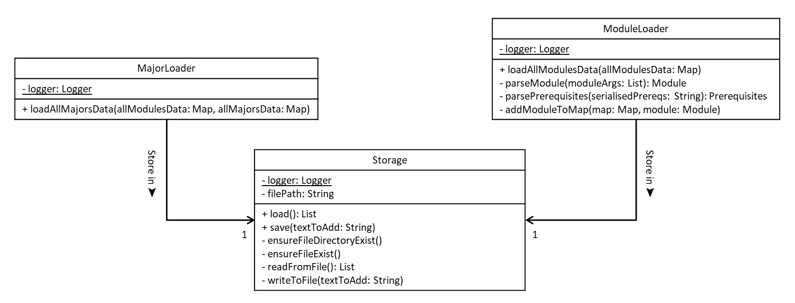

# Developer Guide
- [Getting Started](#getting-started)
- [Design & Implementation](#design--implementation)
    - [High-Level Architecture](#high-level-architecture)
    - [Model Component](#model-component)
        - [Structure of the Model Component](#structure-of-the-model-component)
        - [Key Responsibilities](#key-responsibilities)
        - [Design Rationale](#design-rationale)
    - [Storage Component](#storage-component)
- [Implementation](#implementation)
- [Documentation, Logging and Testing](#documentation-logging-and-testing)
- [Appendix: Requirements](#appendix-requirements)
    - [Product Scope](#product-scope)
        - [Target User Profile](#target-user-profile)
        - [Value Proposition](#value-proposition)
    - [User Stories](#user-stories)
    - [Non-Functional Requirements](#non-functional-requirements)
    - [Glossary](#glossary)
- [Appendix: Instructions for Manual Testing](#appendix-instructions-for-manual-testing)

---

## Acknowledgements
This project was built based on the architecture and documentation style of [AddressBook-Level3 (AB3)](https://se-education.org/addressbook-level3/).  
Concepts, diagram formats, and document structure have been adapted from it for educational purposes.

## Getting Started

## Design & Implementation
This section describes the overall design of **ModHero**, followed by explanations of each major component.  
It serves as a roadmap for future developers to understand how the system is structured, how the components interact, and how each part fulfills its role.

### High-Level Architecture
<figure align="center">
  
  <figcaption><em>High-Level Architecture Diagram of ModHero</em></figcaption>
</figure>

The **ModHero** architecture follows a modular structure inspired by AddressBook-Level3.  
It comprises four main components:
- **UI** — Handles user interaction and display.
- **Logic** — Parses and executes user commands.
- **Model** — Maintains in-memory data (modules, majors, timetable).
- **Storage** — Manages persistent data on disk.

At launch, `Main` initializes these components and connects them.  
At shutdown, it ensures all data is saved correctly to persistent storage.

### Model Component
**API:** `Model.java`

The **Model component** is responsible for managing all in-memory data of ModHero.  
It encapsulates the application’s state — including modules, majors, prerequisites, and the user’s 4-year timetable — and provides APIs for other components to access or modify this data safely.

It resides in the package `modhero.data` and its sub-packages:
- `modhero.data.major`
- `modhero.data.modules`
- `modhero.data.timetable`

#### UML Structure
<figure align="center">
  
  <figcaption><em>UML class diagram showing relationships within the Model component.</em></figcaption>
</figure>

#### Key Responsibilities
- **DataManager** – Central data coordinator that loads, stores, and provides access to model entities.
- **Timetable** – Maintains the 4-year plan, organizing modules by year and semester.
- **Module** – Represents an individual module with code, name, MCs, and prerequisite structure.
- **ModuleList** – Groups modules logically (e.g., core or elective).
- **Prerequisites** – Captures module prerequisites as nested lists.
- **MajorData** – Defines core module sets for each supported major.
- **TimetableModule** – Extends `Module` by adding `year` and `term` fields to specify when a module is taken.

#### Design Rationale
- **Inheritance:** `TimetableModule` *is-a* `Module`, enriched with temporal (year, term) information.
- **Composition:** `DataManager` *has-a* `Timetable`, `ModuleList`, and `Prerequisites` — they exist only while `DataManager` exists.
- **Aggregation:** Modules and majors can exist independently and are aggregated under `DataManager`.

This separation allows the Model to remain cohesive yet modular, enabling clean integration with other components such as Storage and Logic.

### Storage Component
<figure align="center">
    
    <figcaption><em>UML class diagram showing relationships within the Storage component.</em></figcaption>
</figure>
The Storage component is responsible for loading and saving essential application data.
It reads text files from predefined directories and converts their contents into a structured, accessible format for other components to process.

Two primary classes, ModuleLoader and MajorLoader, rely on Storage to retrieve module and major data.
These loaders then deserialize the loaded text into objects such as Module, Major, and Prerequisites, which are stored in in-memory hash maps for efficient access.
The process is supported by two utility classes, SerialisationUtil and DeserialisationUtil, which enhance data conversion and validation.

Each text file is stored in a unique, well-defined format, ensuring accurate data retrieval without missing words or parsing errors.
Deserialization also serves as a validation step, confirming that the entire file has been successfully read and processed.

To maintain data integrity and readability, all data should be serialized before saving, ensuring a consistent and reliable file structure for future loading operations.

## Implementation

## Documentation, Logging and Testing

## Appendix: Requirements

### Product Scope

#### Target User Profile
{Describe the target user profile.}

#### Value Proposition
{Describe the value proposition: what problem does it solve?}

### User Stories

|Version| As a ... | I want to ... | So that I can ...|
|--------|----------|---------------|------------------|
|v1.0|new user|see usage instructions|refer to them when I forget how to use the application|
|v2.0|user|find a to-do item by name|locate a to-do without having to go through the entire list|

### Non-Functional Requirements

{Give non-functional requirements.}

### Glossary

* *glossary item* — Definition.

## Appendix: Instructions for Manual Testing

{Give instructions on how to do manual testing, e.g., how to load sample data or verify stored files.}
